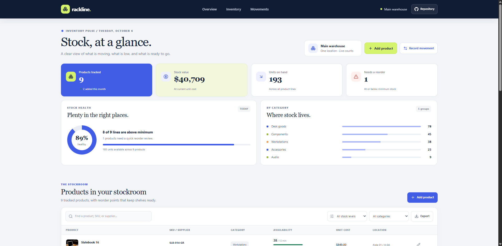

# Rackline Inventory Dashboard

Rackline is a stockroom dashboard for keeping product counts, reorder points, and inventory movement in one clear workspace.

**Live site:** [a2rp.github.io/inventory-dashboard](https://a2rp.github.io/inventory-dashboard/)

## Features

- Review product counts, stock value, stock health, and category totals.
- Add products and edit product details, supplier, location, reorder point, cost, and local product photo.
- Search and filter products by stock level and category.
- Export the current inventory view as a CSV file.
- Record received and issued stock. The available quantity updates immediately, and an issue cannot exceed stock on hand.
- Review low-stock products with a suggested top-up quantity and log a receipt from the reorder queue.
- Review the complete stock movement history, newest first.
- Keep product changes and movement history saved in this browser with local storage.
- Use the responsive navigation, section links, and floating Back to top button on desktop and mobile.

## Run locally

```sh
npm install
npm run dev
```

## Lint and build

```sh
npm run lint
npm run build
```

## Deploy

The project publishes to GitHub Pages from the `gh-pages` branch. To build and publish the current version, run:

```sh
npm run deploy
```

The deployed site is [https://a2rp.github.io/inventory-dashboard/](https://a2rp.github.io/inventory-dashboard/).

## Links

- Portfolio: [https://www.ashishranjan.net](https://www.ashishranjan.net)
- GitHub: [https://github.com/a2rp](https://github.com/a2rp)
- CodePen: [https://codepen.io/ash1198](https://codepen.io/ash1198)
- LinkedIn: [https://www.linkedin.com/in/aashishranjan](https://www.linkedin.com/in/aashishranjan)
- Facebook: [https://www.facebook.com/theash.ashish/](https://www.facebook.com/theash.ashish/)
- YouTube: [https://www.youtube.com/@ashishranjan-ashz?sub_confirmation=1](https://www.youtube.com/@ashishranjan-ashz?sub_confirmation=1)
- Email: [mailto:ash.ranjan09@gmail.com](mailto:ash.ranjan09@gmail.com)

## Support

- Support: [https://a2rp-donation-page.netlify.app/](https://a2rp-donation-page.netlify.app/)
- Buy Me a Coffee: [https://buymeacoffee.com/ashishranjan](https://buymeacoffee.com/ashishranjan)
- Patreon: [https://www.patreon.com/ashishranjan](https://www.patreon.com/ashishranjan)
